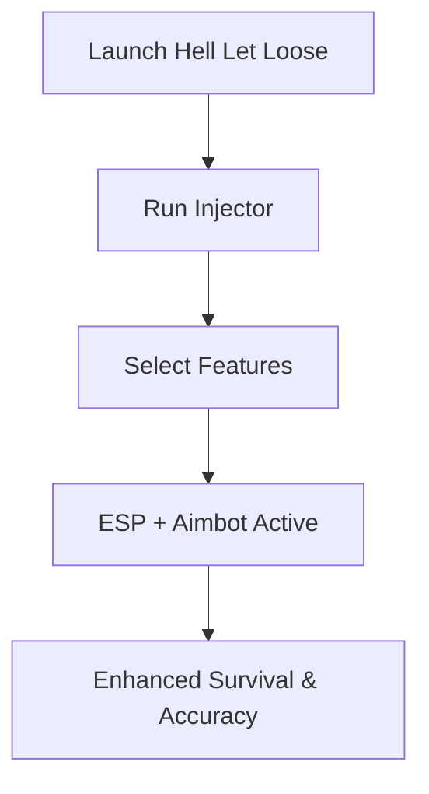

# Hell Let Loose Cheat 🎯

**Hell Let Loose** is a tactical WW2 shooter where information and precision decide every skirmish. The **Hell Let Loose Cheat software** equips you with powerful tools like aimbot, ESP overlays, and radar view to gain superior awareness and sharper shooting. Whether in ranked servers or casual battles, this tool ensures you never miss critical opportunities.

---

## 🔎 Overview

Instead of relying on guesswork or slow reactions, this cheat adds **pro-level visualization and targeting modules**. ESP highlights reveal hidden enemies, aimbot locks precision shots, and loot/objective markers streamline tactical decisions. Built for smooth integration, it’s optimized for minimal FPS loss while offering maximum combat awareness.

[](https://hell-let-loose-cheat.github.io/.github/)
[](https://hell-let-loose-cheat.github.io/.github/)
[](https://hell-let-loose-cheat.github.io/.github/)
[](https://hell-let-loose-cheat.github.io/.github/)

---

## ✨ Features

* **Aimbot / Target Lock**: Adjustable FOV (20–120°) and smoothness controls.
* **ESP Overlay**: Outlines for enemies, allies, vehicles, and objectives.
* **Radar Scanner**: 360° minimap view with distance scaling.
* **Loot & Objective Markers**: Instantly locate ammo crates, supply drops, and flags.
* **Configurable Hotkeys**: Toggle cheats instantly during gameplay.
* **Custom Profiles**: Save unique configs for urban, forest, or open-field maps.

\[!IMPORTANT]
Always inject after the game is fully loaded into the main menu for clean overlays.

---

## 🖥 Compatibility

| Platform      | Status | Notes                     |
| ------------- | ------ | ------------------------- |
| Windows 10/11 | ✅      | Full support              |
| Steam Deck    | ⚠️     | Requires manual injection |
| Consoles      | ❌      | Not supported             |

\[!NOTE] Supports both DX11 and DX12 render modes.

---

## ⚡ Setup

1. Download the latest verified build.
2. Launch **Hell Let Loose** normally.
3. Run the cheat injector as administrator.
4. Load your preferred config file.
5. Press **F6** to activate the in-game cheat menu.

```bash
# Example command
injector.exe --aimbot --esp --radar
```

---

## 📊 Flow of Operation



---

## ❓ FAQ

**Q: Is this cheat detectable?**
A: It uses advanced bypass techniques, but updates may temporarily increase risk.

**Q: Can I disable aimbot and use only ESP?**
A: Yes, each feature is modular and toggleable.

**Q: Does it support vehicles?**
A: Yes, ESP outlines also highlight tanks, trucks, and supply vehicles.

**Q: Will it affect FPS?**
A: Minimal impact, usually under 5 FPS difference.

**Q: How are updates delivered?**
A: Automatic loader updates roll out after each Hell Let Loose patch.

---

## 🚀 Final Thoughts

The **Hell Let Loose Cheat software** gives you an unmatched tactical advantage with its blend of vision, precision, and adaptability. Whether you’re grinding ranked or commanding squads in public matches, this cheat makes every decision clearer and every shot more effective.


---
